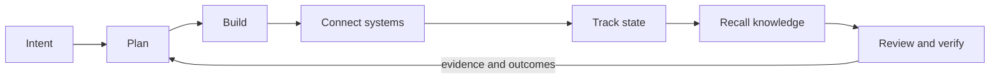
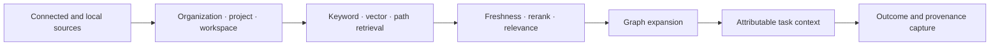
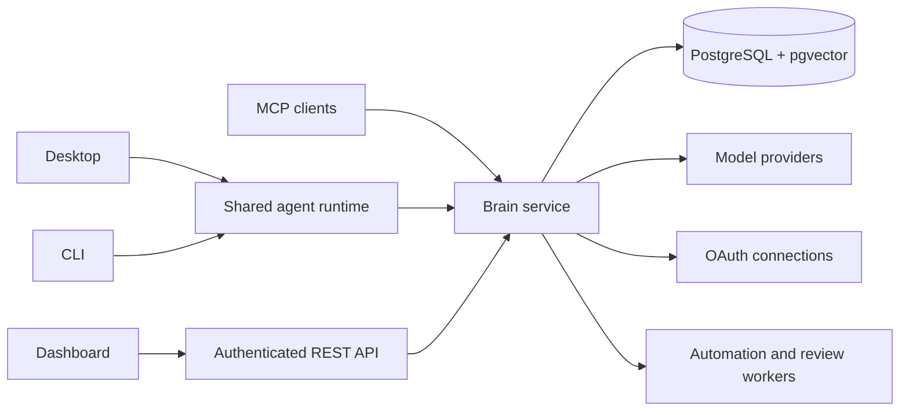

# BrainRouter

### One workspace for agent work that has to stay connected

---

## The problem

Software work is split across chat, terminals, issue trackers, repositories,
knowledge stores, model providers, and review tools. An agent can be capable in
one turn and still lose the project, permissions, evidence, or decision that
made the work correct.

The result is familiar:

- plans drift away from implementation;
- task state and code state disagree;
- connected services require repeated credentials and setup;
- useful context is copied into prompts without scope or provenance;
- reviews arrive as isolated comments instead of part of the work history.

---

## The product

BrainRouter is an open agent operations workspace built around one loop:

**Plan → Build → Connect → Track → Know → Verify**

It brings the agent runtime, model routing, projects, connectors, task tracking,
knowledge, memory, automation, and review evidence into one system while keeping
their trust boundaries explicit.

---

## Four ways to work

| Surface              | Role                                                                                                                                        |
| -------------------- | ------------------------------------------------------------------------------------------------------------------------------------------- |
| **Desktop**          | Primary Chat · Code · Track workbench with projects, sessions, files, plans, tools, terminal, automations, connectors, and reviews          |
| **CLI**              | Terminal-native coding agent using the same runtime, routing, permissions, workflows, and memory lifecycle                                  |
| **Dashboard**        | Authenticated operations surface for organizations, projects, chat, providers, connections, knowledge, repositories, fleet, and review jobs |
| **MCP + REST brain** | PostgreSQL-backed service for cognition, tenancy, integrations, jobs, and third-party clients                                               |

These are different interfaces over shared contracts, not independent products.

---

## One work loop

The active organization, project, workspace, user, and source travel with the
work. A review finding can link back to the repository change; a Track item can
link to its branch or pull request; a chat answer can link to the source chunks
that informed it.

---

## The shared runtime

Desktop and CLI use the same agent turn engine:

- provider and model routing;
- permissions, approvals, sandboxing, and path policy;
- tools, skills, hooks, workers, and multi-agent workflows;
- goal, plan, requirement, and artifact state;
- bounded context, compaction, recall, and capture;
- verification gates and durable handoff.

Changing interface does not change the behavioral contract.

---

## Knowledge that remains attributable

BrainRouter does more than append chat history to a prompt.

Raw source documents and chunks remain available for inspection. Recall can be
filtered to the active project and workspace, and the service validates that
scope instead of trusting browser state.

---

## Connections without passing secrets around

The normal account connection path is server-managed OAuth:

1. an organization administrator configures the provider's OAuth application;
2. a user authorizes their account;
3. BrainRouter seals the credential server-side;
4. the user selects repositories, channels, drives, or other resources;
5. sync jobs checkpoint authorized content into scoped knowledge.

Desktop and dashboard read the same non-secret connection state. Webhook signing
secrets authenticate inbound events; they are not a substitute for account API
credentials.

---

## Track closes the loop

Track is a code-aware project surface inside Desktop:

- board, list, backlog, sprint, roadmap, reports, automation, members, and sync;
- configurable work items, priorities, labels, relationships, and project roles;
- repository detection from the active workspace;
- account-backed issue synchronization;
- links between requirements, tasks, branches, commits, pull requests, findings,
  and artifacts.

The agent can query and update the same project state the human sees.

---

## Review is evidence, not a detached bot comment

BrainRouter has two distinct review paths:

- **Local workspace review** inspects uncommitted changes in Desktop or through
  CLI `/review`, follows repository review policy, and can apply narrowly scoped
  fixes only when explicitly requested.
- **Server-side pull-request review** runs dedicated security and code-review
  lenses through the GitHub App, records job progress, posts attributable
  findings, and exposes policy and history in Dashboard and Desktop.

The security lens owns vulnerability gating. The code-review lens owns
correctness, clarity, architecture, performance, and test feedback. Their
contracts and status stay separate.

---

## Trust boundaries

- Organizations, projects, workspaces, owners, sources, and integrations are
  explicit server-validated scope.
- Model and connector secrets are write-only or sealed and are never returned to
  clients after storage.
- Local execution passes through permission, approval, sandbox, and filesystem
  policy before a tool runs.
- Expanded authority—containers, hosted runtimes, and inbound automation—stays
  opt-in.
- Review claims stay tied to changed code, source metadata, and job evidence.

---

## Architecture

---

## Current status

**0.4.16 is the latest tagged release.** It shipped the unified desktop,
autonomous fleet, mature Track surface, PostgreSQL brain, remote-brain support,
and Atlas codebase knowledge.

**0.4.17 is in development.** It extends the runtime plane, automations,
connectors, review operations, scoped dashboard chat and knowledge, and the
shared dashboard/desktop interface system. Development-branch behavior remains
unreleased until the full acceptance gate passes.

See [`ROADMAP.md`](ROADMAP.md) for planned work and
[`CHANGELOG.md`](CHANGELOG.md) for shipped behavior.

---

## Learn more

- [`README.md`](README.md) — product overview and quick start.
- [`BRAINROUTER.md`](BRAINROUTER.md) — brain, memory, REST, and MCP behavior.
- [`SYSTEM_WORKFLOWS.md`](SYSTEM_WORKFLOWS.md) — end-to-end runtime flows.
- [`SECURITY.md`](SECURITY.md) — security policy and trust boundaries.
- [`design.md`](design.md) — shared dashboard and desktop interface contract.
