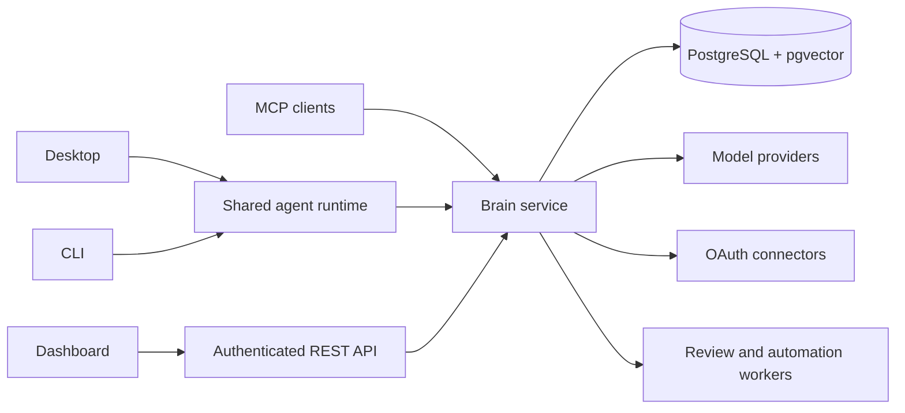

# BrainRouter

[](https://opensource.org/licenses/MIT)
[](https://www.typescriptlang.org/)
[](https://modelcontextprotocol.io/)

BrainRouter is an open agent operations workspace for moving from intent to verified work without losing the task, project, permissions, connected systems, or useful context along the way.

It combines an agent workbench, model routing, project tracking, account-linked connectors, scoped knowledge, automation, durable memory, code and pull-request review, a terminal client, and an MCP/HTTP brain.

## Product surfaces

| Surface                       | Use it for                                                                                                                                        |
| ----------------------------- | ------------------------------------------------------------------------------------------------------------------------------------------------- |
| **Desktop**                   | The primary Chat · Code · Track workbench: projects, sessions, files, plans, requirements, tools, terminal, automations, connectors, and reviews. |
| **CLI (`brainrouter`)**       | A TTY-native coding agent with the same runtime, routing, policy, memory, orchestration, workflows, and goal loop.                                |
| **Dashboard**                 | Authenticated chat, organizations and projects, account connections, providers, repositories, knowledge, review jobs, and system operations.      |
| **Brain (`brainrouter-mcp`)** | PostgreSQL-backed MCP and REST services for cognition, tenancy, connectors, review jobs, triggers, and other clients.                             |
| **Shared packages**           | Typed runtime, SDK, hooks, agent protocol, and public contracts used across every interface.                                                      |

All surfaces share one interaction model: **Plan → Build → Connect → Track → Know → Verify**.

## Architecture



Important boundaries:

- model and integration credentials are stored server-side and sealed with `BRAINROUTER_SECRET_KEY`;
- organizations, projects, workspaces, users, and sources are explicit scope—not a global browser cache;
- account OAuth is the default API credential path, while webhook signing secrets only authenticate inbound events;
- local tools still pass through the runtime permission, approval, sandbox, and path-policy layers;
- review findings remain tied to repository evidence, checks, and attributable vulnerability intelligence.

## Requirements

- Node.js 22+
- npm 10+
- PostgreSQL with pgvector (the development stack is in [`deploy/postgres/`](deploy/postgres/))
- macOS or Windows for the packaged desktop app; source development also works through Electron

## Quick start from source

```bash
git clone https://github.com/kinqsradiollc/BrainRouter.git
cd BrainRouter
npm install

# Start local PostgreSQL + pgvector.
docker compose -f deploy/postgres/docker-compose.yml up -d

# Configure infrastructure and auth.
cp brainrouter/.env.example brainrouter/.env
# Set BRAINROUTER_DATABASE_URL, BRAINROUTER_SECRET_KEY,
# BRAINROUTER_JWT_SECRET, and the first-boot admin values.

npm run build
```

Run the brain and dashboard:

```bash
# Terminal A — MCP + REST on http://localhost:3747
npm run dev:http -w @kinqs/brainrouter-mcp-server

# Terminal B — dashboard on http://localhost:3000
npm run dev -w dashboard
```

Sign in, then configure the organization’s LLM/embedding providers in **Settings → Intelligence**. Providers live in the database; `.env` contains infrastructure and operational settings, not the normal provider credential path.

Run a local client:

```bash
# Terminal workbench
npm run cli

# Desktop workbench
npm run start -w brainrouter-desktop
```

## Install published clients

```bash
npm install -g @kinqs/brainrouter-cli
npm install -g @kinqs/brainrouter-mcp-server
```

Published libraries include [`@kinqs/brainrouter-core`](https://www.npmjs.com/package/@kinqs/brainrouter-core), [`@kinqs/brainrouter-sdk`](https://www.npmjs.com/package/@kinqs/brainrouter-sdk), [`@kinqs/brainrouter-hooks`](https://www.npmjs.com/package/@kinqs/brainrouter-hooks), [`@kinqs/brainrouter-agent-protocol`](https://www.npmjs.com/package/@kinqs/brainrouter-agent-protocol), and [`@kinqs/brainrouter-types`](https://www.npmjs.com/package/@kinqs/brainrouter-types).

The CLI setup wizard configures its local model and brain connection. It can run with local tools when the remote brain is unavailable; use `--strict-mcp` when an offline fallback is not acceptable.

## Connections and knowledge

The shared connection flow is:

1. an organization admin configures the provider OAuth app in Dashboard → Connections;
2. a user connects their account;
3. the service seals the user token and exposes status/resources without returning it;
4. server-side sync checkpoints the selected source into the owner’s memory;
5. desktop and dashboard read the same connection and sync state.

Supported OAuth sources include GitHub, GitLab, Slack, Google Drive, Gmail, Notion, and Linear. Additional runtime connectors include filesystem, web, Jira, Confluence, and MCP resources where their credential model applies.

Knowledge and source requests carry organization, project, and workspace scope. Record ownership and source provenance stay attached to the returned evidence. Recall combines keyword, vector, file-path, freshness, reranking, relevance judging, and graph expansion, then returns attributable records instead of an opaque context blob.

## Reviews and automation

- Desktop and dashboard can inspect backend pull-request review jobs and findings; local uncommitted-change review remains a separate workspace action.
- GitHub App installation credentials support repository linking, check-runs, and webhook-triggered review automation.
- Track detects a repository from the active workspace remote and uses the signed-in account connection before any advanced local-token fallback.
- Security and code-review prompts can consume a bounded, cached vulnerability-intelligence briefing with source and retrieval metadata.

See [`brainrouter-docs/setup/github-app-setup.md`](brainrouter-docs/setup/github-app-setup.md) for the GitHub trust boundaries and [`brainrouter-docs/automations.md`](brainrouter-docs/automations.md) for automation behavior.

## Development

```bash
# Build packages before apps that consume their compiled output.
npm run build:packages
npm run build:apps

# Repository-wide verification.
npm run typecheck
npm run test
npm run lint
```

Desktop verification rebuilds shared dependencies automatically:

```bash
npm run test -w brainrouter-desktop
```

Read [`CLAUDE.md`](CLAUDE.md) and the relevant package rules before editing. The durable visual and interaction contract is [`design.md`](design.md).

## Documentation

- [`SETUP.md`](SETUP.md) — operator and maintainer setup/runbook.
- [`BRAINROUTER.md`](BRAINROUTER.md) — brain, memory, REST, and MCP behavior.
- [`SYSTEM_WORKFLOWS.md`](SYSTEM_WORKFLOWS.md) — end-to-end runtime flows.
- [`SECURITY.md`](SECURITY.md) — security policy and trust boundaries.
- [`BENCHMARKS.md`](BENCHMARKS.md) — reproducible evaluation commands and results.
- [`brainrouter-docs/`](brainrouter-docs/) — configuration, architecture decisions, connectors, automation, and deep dives.
- [`ROADMAP.md`](ROADMAP.md) and [`CHANGELOG.md`](CHANGELOG.md) — planned and shipped work.

## License

MIT — see [`LICENSE`](LICENSE).
