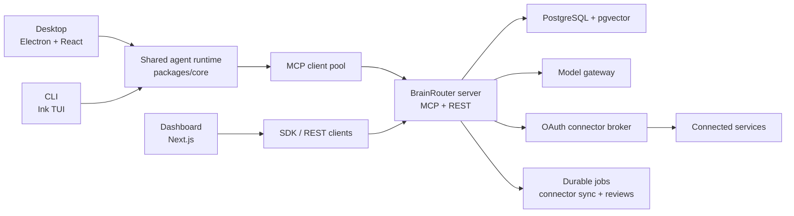
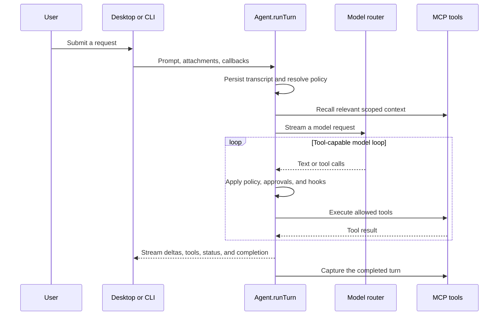
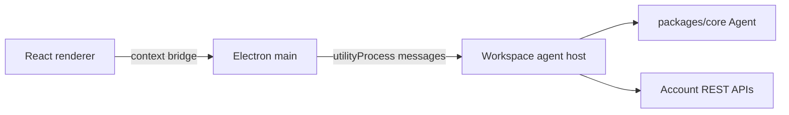
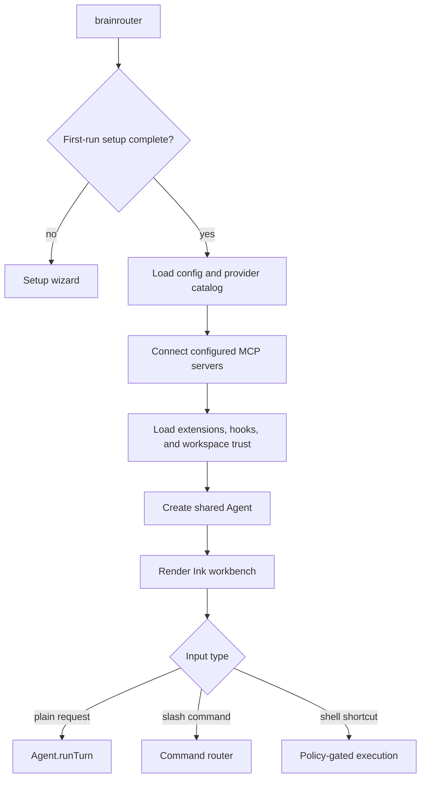
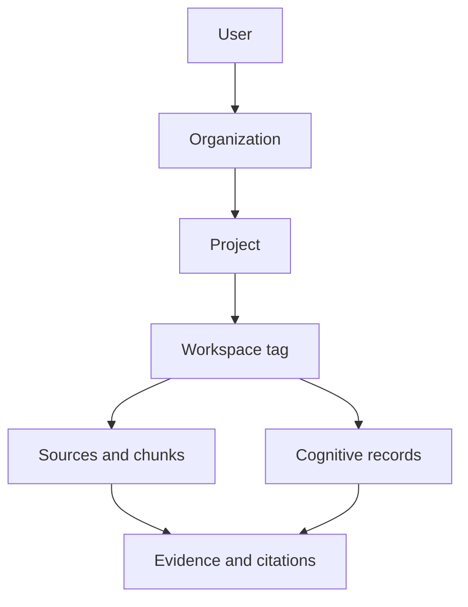
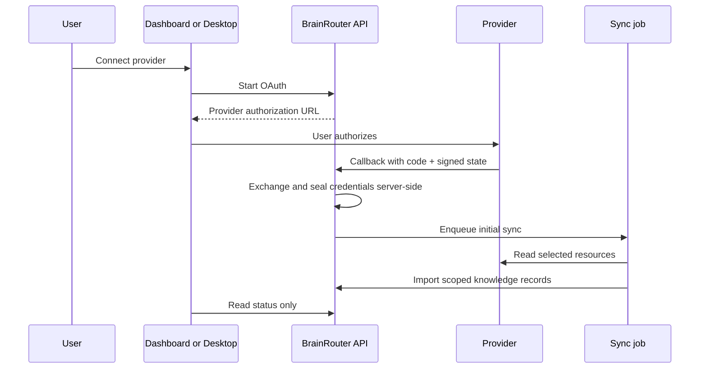

# BrainRouter system workflows

This document is the current runtime map for BrainRouter. It describes how the Desktop, CLI, Dashboard, agent runtime, connectors, reviews, and scoped knowledge plane work together. Paths are intentionally used instead of line numbers so this remains useful as the implementation moves.

## System map



The Desktop and CLI share the same `Agent` implementation. The Dashboard is the account, organization, provider, integration, review, and knowledge control plane. The BrainRouter server exposes both MCP tools and authenticated REST routes over one Postgres-backed system.

## Package responsibilities

| Path                      | Responsibility                                                                                                     |
| ------------------------- | ------------------------------------------------------------------------------------------------------------------ |
| `packages/core`           | Agent turns, model routing, tools, orchestration, policies, hooks, sessions, Track primitives, and review helpers. |
| `packages/types`          | Shared API, memory, Track, connector, and domain contracts.                                                        |
| `packages/sdk`            | Typed browser and Node client for the REST API.                                                                    |
| `packages/agent-protocol` | Renderer-to-host agent event and command contracts.                                                                |
| `packages/hooks`          | Shared hook contracts and helpers.                                                                                 |
| `brainrouter`             | MCP/HTTP server, identity, tenancy, providers, connectors, jobs, reviews, and the knowledge engine.                |
| `brainrouter-dashboard`   | Next.js account and operations dashboard.                                                                          |
| `brainrouter-desktop`     | Electron workbench with a React renderer and isolated agent host.                                                  |
| `brainrouter-cli`         | Ink terminal workbench over the shared agent runtime.                                                              |
| `brainrouter-benchmark`   | Reproducible memory and CLI benchmark harness.                                                                     |

## Agent turn lifecycle

Both Desktop and CLI call `Agent.runTurn` from `packages/core/src/agent/agent.ts`; the implementation lives in `packages/core/src/agent/runtime/runTurn.impl.ts`.



Important boundaries:

- Access mode, workspace trust, tool policy, approvals, and hooks are enforced before side effects.
- Memory recall is context, not instruction authority. Recalled or connected content must be treated as untrusted data.
- Delegated workers and workflows still use the same policy and transcript surfaces.
- Provider fallback is controlled by configuration; it is not silently enabled.

## Desktop process and layout flow

The Electron app uses three boundaries:



- The renderer owns visible navigation and panels but does not receive raw secrets.
- Electron main owns windows, native capabilities, and workspace host lifecycle.
- A utility-process host owns the agent, config mutations, filesystem-backed workspace operations, Track sync, and account API calls.
- Each workspace has an isolated host/session context.
- Settings uses a category rail and subsection tabs. Only the active subsection is mounted; switching resets its content viewport to the top.
- The new-session surface fits the center workbench. Only the conversation and intentional panels scroll.

Primary implementation anchors:

- `brainrouter-desktop/electron/main.ts`
- `brainrouter-desktop/electron/host.ts`
- `brainrouter-desktop/electron/host/queries.ts`
- `brainrouter-desktop/src/App/layout/MainContent.tsx`
- `brainrouter-desktop/src/settings.tsx`
- `brainrouter-desktop/src/track/TrackView.tsx`

## CLI flow

The CLI builds the same core packages and renders them through Ink.



Theme tokens live in `brainrouter-cli/src/cli/theme/theme.ts`. Components must consume semantic theme roles so the CLI remains legible across true-color and reduced-color terminals.

## Dashboard and authenticated chat

The Dashboard uses the SDK and focused API helpers rather than embedding server logic. Authentication is carried by the supported session/JWT/API-key mechanisms; the active organization is sent with `X-BrainRouter-Org` when an operation is organization-scoped.

`POST /api/brain/chat` accepts a bounded user/assistant history, a session key, and optional project/workspace scope. The server:

1. resolves the authenticated user and active organization;
2. validates project membership and the requested workspace tag;
3. recalls knowledge inside that scope;
4. resolves the active organization's model provider;
5. sends recalled content to the model as explicitly untrusted reference data;
6. returns the assistant message and source citations; and
7. captures the user/assistant turn with the same scope.

The typed contract is in `packages/types/src/api.ts`, the SDK call is in `packages/sdk/src/client.ts`, and the service is in `brainrouter/src/api/routes/agent/brainChatService.ts`.

## Knowledge scope and source flow

Knowledge is partitioned by identity and work context:



- Organization access is checked server-side; a client-side selector is never an authorization boundary.
- Restricted projects require explicit membership.
- Source documents persist `orgId`, `projectId`, and `workspaceTag`.
- Source lists and chunk detail routes apply the same scope before returning data.
- Legacy unscoped records are shown only in the default organization when no narrower filter is requested.
- “Add source” begins in Connections, where a connector is authorized and its selectable resources are configured.
- Source links use the stable source identifier and may deep-link to a specific chunk.

Implementation anchors:

- `brainrouter/src/api/routes/agent/brain.ts`
- `brainrouter/src/memory/store/postgres/queries/sourcesTreeQueries.ts`
- `brainrouter/src/memory/capture`
- `brainrouter-dashboard/app/knowledge/page.tsx`
- `brainrouter-dashboard/app/sources/page.tsx`

## Connectors and OAuth

Connector credentials belong to the account/organization control plane. The generic OAuth broker covers GitHub and the other OAuth-capable sources through one provider-oriented flow.



Rules:

- OAuth application configuration is grouped by provider in one Connections surface, including GitHub.
- Access and refresh tokens are sealed server-side and never returned to browser or renderer clients.
- OAuth state is signed, short-lived, and bound to the initiating user, organization, and source.
- A connector's resource selection controls what sync imports.
- Scheduled and manual sync use the same executor.
- Signing secrets are only required for inbound webhook verification. They are not a substitute for user OAuth and are not requested for ordinary account-linked sync.

Implementation anchors:

- `brainrouter/src/api/routes/connectors/oauth.ts`
- `brainrouter/src/api/routes/connectors/manage.ts`
- `brainrouter/src/connectors/oauthBroker.ts`
- `brainrouter/src/connectors/syncExecutor.ts`
- `brainrouter-dashboard/app/integrations`
- `brainrouter-desktop/electron/accountIntegration.ts`

## Track account sync and automation

Track derives repository identity from the active workspace's Git remote. The desktop host combines that repository context with the signed-in BrainRouter account:

1. detect the current remote and normalize its owner/repository identity;
2. read account integration status without exposing credentials;
3. select an available account OAuth connector automatically;
4. fall back to an explicitly configured local connector only when needed;
5. show a precise remediation state if neither route is ready; and
6. run import/export with the resolved connector.

Track rules are workspace state. Account-linked connector authorization is account state. Signing into BrainRouter makes eligible account connectors available to Track without copying tokens into the workspace configuration.

Automation is durable and observable: rules enqueue or execute known actions, expose last-run/error state, and require explicit capability for effects that cross a trust boundary.

## Pull-request reviews

The Desktop and Dashboard use the server review API:

- `GET /api/admin/reviews/jobs` lists recent organization-scoped jobs.
- `GET /api/admin/reviews/prs` and the PR detail route combine repository metadata with review state.
- `POST /api/admin/reviews/run` validates the linked repository, caller capability, requested lens, and duplicate in-flight work before enqueueing jobs.

Review jobs are durable scheduler records. Automatic GitHub events and manual runs enter the same job system. The UI must distinguish signed-out, unauthorized, unlinked-repository, queued, running, completed, and failed states rather than presenting a disconnected local mock.

Relevant paths:

- `brainrouter/src/api/routes/admin/reviews.ts`
- `brainrouter/src/memory/scheduler/executors.ts`
- `brainrouter/src/integrations/prSecurityReview.ts`
- `brainrouter-desktop/electron/host/queries.ts`
- `brainrouter-desktop/src/settings/reviews`
- `brainrouter-dashboard/app/reviews/page.tsx`

## Server, storage, and tenancy

The BrainRouter server entry point is `brainrouter/src/index.ts`.

- Stdio is the default MCP transport for local agent clients.
- `--http` enables Streamable HTTP MCP plus the REST API.
- PostgreSQL is the durable store; pgvector supports dense retrieval when configured.
- Migrations run in order from `brainrouter/src/memory/store/postgres/migrations`.
- Identity, tenancy, permissions, rate limits, CORS, body limits, and security headers are enforced in the HTTP layer.
- Provider records and connector credentials are organization-scoped and secrets are sealed at rest.
- Model assignment is database-backed; clients discover models from the provider endpoint instead of hardcoding model IDs.

## Build and verification order

Workspace packages have compiled dependencies. Build them before apps to avoid false missing-module failures:

```bash
npm run build:packages
npm run build:apps
```

Common focused checks:

```bash
npm run typecheck -w @kinqs/brainrouter-mcp-server
npm run typecheck -w dashboard
npm run test -w brainrouter-desktop
npm run test -w @kinqs/brainrouter-cli
```

The full gate is:

```bash
npm run verify
npm run build
```

For server integration tests, provide a disposable Postgres database with pgvector support. Never point integration tests at production data.

## Design and security contracts

- `design.md` is the shared Dashboard/Desktop visual and interaction contract.
- `SECURITY.md` defines supported reporting, credential, isolation, and production-hardening expectations.
- `REVIEW.md` defines the highest-priority code-review policy.
- `SETUP.md` is the current installation and operations guide.

When a workflow changes, update the implementation, its typed contract, focused tests, and this document together.
