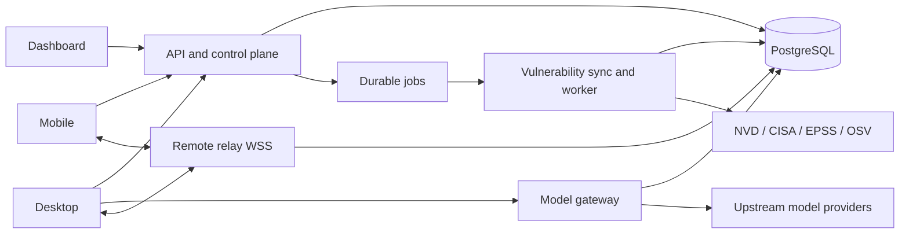

# Spec — Server-managed models, synchronized product UX, remote access, and CVE intelligence

> Status: **APPROVED — implementation in progress.** Date: 2026-07-14.
> Approval note: the canonical logo must be rendered and exported from code; no raster logo asset is shipped.
> Owner: backend, dashboard, desktop, and mobile.
> Companion plan: `IMPLEMENTATION_PLAN_SERVER_PROVIDER_PRODUCT_SIMPLIFICATION_CVE.md`.
> Extends: `enterprise-multitenancy-and-providers.md`; `design.md` remains the visual authority and will be updated during implementation.

## 1. Assumptions to approve

1. **BrainRouter is an additional hosted provider, not a replacement for BYOK.** A signed-in desktop receives an organization-scoped BrainRouter model catalog and can use the hosted proxy. Existing local, direct, and custom OpenAI-compatible providers remain available.
2. **Server policy is authoritative only for server-managed models.** Custom/BYOK endpoints may use explicitly labelled inferred capabilities when the endpoint does not publish metadata.
3. **Dashboard and desktop share one product language, not one layout.** They use the same mark, tokens, model/review contracts, state labels, and control geometry while retaining platform-appropriate shells.
4. **Remote desktop access means account-authenticated outbound WSS.** The laptop and phone both connect outward to a broker. QR codes, inbound laptop ports, LAN IPs, Tailscale, and the tunnel stack are not the normal pairing or transport path.
5. **Remote access is opt-in and least-privilege.** Monitoring can be granted separately from control and approval. A reusable account/API/refresh token is never sent over the relay connection.
6. **CVE intelligence is defensive inventory and prioritization.** A catalog entry is not proof that a repository is affected. An exposure requires exact package/PURL or CPE plus version-range evidence.
7. **PostgreSQL remains mandatory.** The implementation adds independently deployable model-gateway, remote-relay, and vulnerability-sync responsibilities while preserving a single-image self-hosted option.
8. **The Strix reference informs hierarchy and density only.** BrainRouter will not copy Strix trademarks, proprietary assets, product copy, or distinctive brand geometry.

## 2. Objective

Deliver one coherent BrainRouter product in which:

- an administrator controls which hosted models and reasoning efforts an organization may use;
- desktop users see that live policy beside the model selector and can still use personal providers;
- an OpenAI-compatible BrainRouter proxy performs tenant-safe streaming upstream calls without exposing provider credentials;
- Overview, Chat, PR Reviews, settings, Brand Studio, and the desktop workbench use a compact shared design system without long mixed-purpose pages or hidden overflow;
- a signed-in phone can discover and securely connect to an enrolled laptop from another network without QR pairing or an inbound tunnel; and
- a durable CVE catalog ingests authoritative updates, scans authorized repositories, and re-evaluates stored inventories when future CVEs change.

Success means the behavior is usable end to end, tenant-isolated, observable, containerized, documented in `design.md`, and covered by unit, integration, browser, Electron, mobile, and Compose smoke tests.

## 3. Current baseline and terminology

### 3.1 Reusable baseline

- `provider_configs` already stores encrypted organization-scoped upstream configuration.
- `/api/admin/providers` already provides provider CRUD under RBAC.
- `packages/core/src/router/` already has useful local OpenAI-compatible routing and streaming primitives.
- dashboard and desktop already have account, connector, review, settings, and model surfaces.
- the desktop relay already has scoped RPC methods, frame limits, application encryption helpers, and replay counters.
- `packages/core/src/review/vulnerabilityIntelligence.ts` already has bounded CISA KEV parsing, cache integrity, provenance, and stale fallback.
- Postgres `memory_jobs` and the worker already provide durable jobs, progress, retry, and competing-consumer execution.

### 3.2 Repository review state contract

The product must never collapse these states into one “linked” boolean:

| State | Meaning | Controls |
|---|---|---|
| Account connected | A user completed GitHub/GitLab authorization. | Whether a user credential may be resolved server-side. |
| Repository accessible | The selected App or account credential can read the repository now. | Manual PR list, detail, Security review, and Code review. |
| Automatic review enabled | The repository is in the organization’s webhook/automation policy. | Event-driven and push-triggered reviews only. |

The 2026-07-14 baseline hotfix already makes manual GitHub list/detail/run use an accessible App or the signed-in user’s sealed credential, scopes PR caches by organization and user, and keeps tokens out of jobs/responses. New work must preserve those tests and use the three-state vocabulary in dashboard and desktop.

## 4. Scope and non-goals

### In scope

- Per-model enablement, display metadata, default, allowed efforts, and effort wire mapping.
- A safe member-readable model catalog and admin model-policy APIs.
- Hosted `/v1/models`, `/v1/chat/completions`, and `/v1/responses`, including streaming, tool payloads, cancellation, usage, and canonical errors.
- A built-in signed-in BrainRouter provider in desktop plus unchanged custom/BYOK paths.
- Shared logo, visual tokens, interaction vocabulary, compact page IA, and overflow/zoom verification.
- Account-based device enrollment, presence, grants, revocation, broker tickets, WSS forwarding, and E2EE session frames.
- NVD, CISA KEV, FIRST EPSS, and OSV-backed catalog/inventory workflows.
- Schema, RBAC, APIs, workers, Dockerfiles, Compose, health/readiness, CI, docs, and migration.

### Non-goals

- Reproducing Strix pentesting behavior or offensive exploitation workflows.
- Removing local providers, personal API keys, custom endpoints, or offline operation.
- Sending upstream provider keys to the renderer, CLI, desktop, or a credential-resolution HTTP endpoint.
- Treating model-name regexes as verified server policy.
- Making the relay server able to decrypt terminal or control payloads.
- Claiming a repository is vulnerable from product-name text matching alone.
- Replacing GitHub/GitLab authorization with another repository connection flow.

## 5. Verified model and effort contract

Capability data is versioned server metadata. Seeded entries must cite an authoritative provider source and a verification date. Admin overrides are allowed but labelled `manual`.

Verified on 2026-07-14 from the [OpenAI model catalog](https://developers.openai.com/api/docs/models), [GPT-5.6 Sol model page](https://developers.openai.com/api/docs/models/gpt-5.6-sol), [Anthropic model overview](https://platform.claude.com/docs/en/about-claude/models/overview), [Anthropic effort documentation](https://platform.claude.com/docs/en/build-with-claude/effort), and [Anthropic extended-thinking documentation](https://platform.claude.com/docs/en/build-with-claude/extended-thinking):

| Upstream model | Public seed ID | Selectable effort | Default / special behavior | Native wire field |
|---|---|---|---|---|
| GPT-5.6 Sol | `gpt-5.6-sol` (`gpt-5.6` alias) | `none`, `low`, `medium`, `high`, `xhigh`, `max` | Provider default unless org policy narrows it | Responses: `reasoning.effort`; Chat: `reasoning_effort` |
| GPT-5.6 Terra | `gpt-5.6-terra` | `none`, `low`, `medium`, `high`, `xhigh`, `max` | Provider default unless org policy narrows it | Same OpenAI mapping |
| GPT-5.6 Luna | `gpt-5.6-luna` | `none`, `low`, `medium`, `high`, `xhigh`, `max` | Provider default unless org policy narrows it | Same OpenAI mapping |
| Claude Fable 5 | `claude-fable-5` | `low`, `medium`, `high`, `xhigh`, `max` | `high` default; adaptive thinking is always on; manual `budget_tokens` is unsupported | Anthropic Messages: `output_config.effort` |
| Custom/BYOK model | Admin/user supplied | Explicit endpoint metadata or labelled inference only | No effort control when capability is unknown | Provider-specific adapter |

`ultracode` is not an Anthropic API effort and must not be sent as one. If retained as a future desktop orchestration mode, it is a separate workflow control and never aliases or replaces `xhigh`/`max` in the model policy.

Older and future models are added from model-specific provider documentation. A generic provider enum must not broaden a model-specific effort list.

## 6. Model control plane

### 6.1 Data model

Keep `provider_configs` for encrypted endpoint/key custody. Add `provider_models`:

| Column | Contract |
|---|---|
| `id`, `org_id`, `provider_config_id` | Tenant and upstream ownership; hard foreign keys. |
| `public_model_id`, `upstream_model_id`, `display_name` | Stable client ID is distinct from the upstream ID. Unique `(org_id, public_model_id)`. |
| `enabled`, `is_default`, `sort_order` | Only enabled models are returned/accepted; one default per organization policy. |
| `allowed_efforts_json`, `default_effort` | Empty means no effort selector, never “accept anything.” Default must be allowed. |
| `effort_wire_map_json` | Maps canonical policy values to an upstream field/value; no silent level collapsing. |
| `capabilities_json` | Streaming, tools, Responses, modalities, context/output limits, reasoning mode. |
| `capability_source`, `source_url`, `verified_at` | `verified`, `discovered`, or `manual` provenance. |
| timestamps | Audit and catalog revision inputs. |

Add append-only `model_usage_events` with request ID, organization, user/service principal, public model, selected effort, upstream route, latency, status, usage, and cost estimate. Prompt/response bodies and provider secrets are excluded by default.

### 6.2 Shared public types

```ts
export interface ModelPolicy {
  id: string;
  label: string;
  provider: "brainrouter";
  enabled: boolean;
  capabilities: {
    streaming: boolean;
    tools: boolean;
    responses: boolean;
    reasoning: boolean;
  };
  reasoning: null | {
    default: string;
    allowed: Array<{ id: string; label: string }>;
    source: "verified" | "discovered" | "manual" | "inferred";
  };
  revision: string;
}
```

Use camelCase API/TypeScript fields, snake_case SQL, explicit unions, schema validation at every boundary, and no `any` in new contracts.

### 6.3 APIs

Member-safe catalog:

- `GET /api/models/catalog` — authenticated; server resolves and verifies active organization membership; returns enabled safe metadata, a revision, and `ETag`; never endpoints or keys.

Admin control plane (`models:manage`, or deliberately mapped to `providers:manage` during migration):

- `GET /api/admin/models`
- `POST /api/admin/models/discover`
- `POST /api/admin/models`
- `PATCH /api/admin/models/:id`
- `DELETE /api/admin/models/:id`
- `POST /api/admin/models/:id/default`

Writes validate provider ownership, unique public IDs, allowed/default effort invariants, capability provenance, and at least one usable default when the hosted provider is enabled. Provider selection of “all discovered models” is stored explicitly, not as an ambiguous empty array.

## 7. Hosted OpenAI-compatible model gateway

### 7.1 Data-plane endpoints

- `GET /v1/models`
- `POST /v1/chat/completions`
- `POST /v1/responses`

The service returns OpenAI-compatible error envelopes, request IDs, streaming/non-streaming results, usage, tool calls, and cancellation behavior. Unsupported fields fail explicitly rather than being silently dropped.

### 7.2 Request algorithm

1. Authenticate a BrainRouter access JWT/API key or scoped internal service credential.
2. Reject refresh tokens, disabled users, invalid audience/scope, and stale membership.
3. Resolve organization from verified auth context; never trust a body-supplied `orgId`.
4. Resolve an enabled `public_model_id` in that organization.
5. Validate `reasoning_effort` or `reasoning.effort` against the exact model policy.
6. Map the canonical effort through the model’s adapter.
7. Decrypt the upstream key only inside the gateway process.
8. Apply organization/user quotas, concurrency, timeout, abort, and bounded retry policy.
9. Stream normalized output and sanitize upstream errors.
10. Record metadata-only usage/audit information.

The current `/v1/resolve` route must be removed or made internal-only during migration. No HTTP route returns a decrypted upstream key.

Admin-supplied endpoints require SSRF controls: normalized HTTPS URL, DNS/IP resolution checks, redirect revalidation, and default denial of loopback, private, link-local, and cloud-metadata addresses in hosted mode. Self-hosted private endpoints require an explicit deployment allowlist.

### 7.3 Desktop behavior

- When signed in and authorized for `models:read`, desktop exposes a built-in `BrainRouter` provider pointed at the account server’s `/v1` data plane.
- The account credential stays in Electron’s main process/OS-protected storage; model metadata crosses the bridge, not the bearer.
- Catalog revision/ETag updates refresh the selector without restarting desktop.
- Model and Effort render as one adjacent 30px composite control with separate keyboard/focus targets. Model truncates first; effort remains visible.
- Server-managed entries never use regex inference. Custom/BYOK entries keep current provider setup and may use an `Inferred` capability badge.
- If a policy disables the active model/effort, the next request is blocked with a clear selection prompt; it is never silently changed mid-conversation.

## 8. Shared product design and information architecture

### 8.1 Brand contract

Replace the three current identities (guilloché Brand Studio mark, dashboard `B`, desktop gradient/`B`) with one canonical **Routed B** geometry: two simple paths converging into a legible B/router junction. Requirements:

- geometry is defined as typed path/view-box constants and rendered by accessible inline SVG/React code; the generated exploration board is reference-only and is not a product asset;
- no PNG, JPEG, WebP, base64/data URI, SVG `<image>`, CSS `background-image`, or runtime image request may render the logo;
- works as a one-color 16px glyph, 32px app mark, wordmark lockup, avatar, and print/export asset;
- neutral graphite/white are primary; accent is optional and never the only state signal;
- geometry, safe zone, SVG path data, and variants live in one source module/generator;
- dashboard, auth, desktop rail/settings, mobile, favicon, and Brand Studio consume coded SVG variants from that source;
- Brand Studio keeps its export/templates/safe-zone engine but uses the canonical geometry and palette.

`design.md` will document the mark, tokens, layout rules, component states, model-policy UX, review-state vocabulary, remote-access flow, CVE provenance, and responsive/zoom matrices.

### 8.2 Dashboard IA

- **Overview:** one-screen actionable summary—attention queue, recent work, connected repositories, concise operational metrics, and one dominant New task action. Deep review analytics move to Review/Quality surfaces.
- **Chat:** compact session rail, durable history, central thread, one composer, small task suggestions, and the same Model/Effort vocabulary as desktop.
- **PR Reviews:** filterable PR list only. Move policy defaults and repository automation to `Settings → Workspace → Review automation`. PR detail uses findings/work in the main column and a sticky timeline/checks/repository/run panel.
- **Settings:** preserve category routing and render one selected panel. Split Intelligence into Managed models, Personal/BYOK, Routing, Profiles, and Subagents. Do not return to an all-settings page.
- **CVE:** `Catalog` and `My exposure` tabs. Catalog has search, severity, CVSS, EPSS, KEV, ecosystem, date, source freshness, and dense rows. Exposure adds repository/component/fixed-version evidence and manual Scan action.

### 8.3 Desktop shell

- Preserve Chat / Code / Track and contextual right panels.
- Split the oversized Models settings panel using the same Managed/Personal/Routing/Profiles/Subagents vocabulary.
- Standard desktop controls are 30px; dashboard controls are 32px. Icon-only controls have equal width/height.
- The sidebar collapse/reopen control remains anchored beside macOS traffic lights using inverse-zoom geometry.
- From 0.5× through 2.5× zoom, no page-level horizontal scroll, clipped button, or unreachable hidden panel is allowed. Narrow widths replace hidden panels with a visible drawer/reopen control.

## 9. Account-based remote desktop access

### 9.1 Services and persistence

Add a public `remote-relay` WSS edge and these tenant-scoped records:

- `auth_device_sessions` — hashed rotating refresh-token families, expiry, reuse detection, and revocation;
- `remote_devices` — stable installation ID, user, kind, display name, enrolled public key, status, last seen;
- `remote_access_grants` — desktop/mobile pair, scopes (`monitor`, `control`, `approve`), approval, expiry, revocation;
- `remote_access_audit` — enrollment, connection, scope changes, and revocation, excluding terminal/payload content.

### 9.2 Flow

1. Desktop sign-in creates a stable installation key in OS-protected storage and explicitly enables remote access.
2. Desktop enrolls its public key and opens outbound WSS using a short-lived, device-bound `aud=remote-relay` ticket plus signed challenge.
3. Mobile signs in, enrolls its own key, and stores only rotating device credentials in SecureStore.
4. `GET /api/remote/desktops` returns the user’s devices and presence, never IP addresses, workspace roots, or local relay endpoints.
5. `POST /api/remote/desktops/:id/sessions` validates both devices and a grant; elevated scopes can require desktop confirmation.
6. The API returns a single-use 30–60 second relay ticket. Both devices authenticate keys and establish an ephemeral E2EE session bound to ticket, transcript, epoch, scope, and per-direction counter.
7. The broker forwards opaque bounded frames only. Broker ticket scope and desktop RPC allowlist both enforce authority.
8. Revocation closes active sessions and invalidates refresh-token families/tickets immediately.

Primary endpoints:

- `POST /api/remote/devices/enroll/challenge`
- `POST /api/remote/devices/enroll/complete`
- `GET /api/remote/devices`
- `DELETE /api/remote/devices/:id`
- `GET /api/remote/desktops`
- `POST /api/remote/desktops/:id/grants`
- `PATCH /api/remote/grants/:id`
- `POST /api/remote/desktops/:id/sessions`
- `GET /remote-relay` (WSS upgrade with single-use ticket)

No API key, access JWT, refresh token, password, or reusable credential may appear in a WebSocket frame, URL/query string, log, QR code, session metadata, or relay persistence. QR/manual pairing and local `ws://` advertisements are removed from the primary mobile UI after migration.

## 10. CVE intelligence and repository exposure

### 10.1 Authoritative inputs

- [NVD CVE API 2.0](https://nvd.nist.gov/developers/vulnerabilities) — CVE catalog and incremental modified-date synchronization.
- [CISA Known Exploited Vulnerabilities](https://www.cisa.gov/known-exploited-vulnerabilities-catalog) — exploitation-priority enrichment, not affected-component evidence.
- [FIRST EPSS API](https://www.first.org/epss/api) — exploitation probability enrichment.
- [OSV API](https://google.github.io/osv.dev/api/) — exact package/ecosystem/version or PURL matching, including batched repository inventories.

Every source has a durable cursor, last successful refresh, ETag/checksum where available, retry state, and freshness displayed in the product. Ingestion uses bounded payloads, timeouts, schema validation, provenance, idempotent upserts, distributed locking, and stale-source reporting.

### 10.2 Persistence

Global catalog:

- `vulnerability_sources`, `vulnerability_feed_runs`
- `vulnerabilities`, `vulnerability_observations`
- `vulnerability_affected_ranges`, `vulnerability_aliases`, `vulnerability_references`

Organization scope:

- `asset_inventories`, `asset_components`
- `vulnerability_scans`, `vulnerability_matches`
- `vulnerability_watch_subscriptions`

Source observations are preserved rather than overwritten. Deterministic precedence produces a materialized display view. A match identity is stable across rescans so updates change state instead of duplicating notifications.

### 10.3 Jobs and APIs

Jobs:

- scheduled NVD incremental sync;
- CISA KEV and EPSS enrichment refresh;
- manual source refresh by `vulnerabilities:manage`;
- authorized repository inventory from supported lockfiles/manifests/SBOM;
- OSV querybatch matching and deterministic upsert;
- bounded re-evaluation when a new/modified affected range intersects a stored inventory.

APIs:

- `GET /api/vulnerabilities`
- `GET /api/vulnerabilities/:cveId`
- `GET /api/vulnerability/sources`
- `POST /api/vulnerability/sources/:id/refresh`
- `POST /api/vulnerability/scans`
- `GET /api/vulnerability/scans`
- `GET /api/vulnerability/scans/:id`
- `GET /api/vulnerability/findings`
- `PATCH /api/vulnerability/findings/:id`
- vulnerability watch-subscription CRUD

RBAC is explicit: `vulnerabilities:read`, `vulnerabilities:scan`, and `vulnerabilities:manage`. Repository scans also require current repository accessibility and an authorized organization scope.

## 11. Service topology and deployment



Responsibilities:

- **API/control plane:** identity, tenancy, provider-secret writes, model policy/catalog, remote enrollment/grants/tickets, CVE reads/scans.
- **Model gateway/data plane:** `/v1/*`, policy enforcement, upstream streaming, quota, and usage; never credential resolution responses.
- **Remote relay:** WSS ticket validation, presence, revocation, bounded opaque forwarding; no payload decryption.
- **Worker/vulnerability sync:** discovery, metadata refresh, feed cursors, inventory, matching, and scheduled re-evaluation.
- **Brain/MCP:** calls the gateway with scoped internal service auth; does not own process-global tenant model state.

Deployment changes:

- multi-stage image builds `types`, `agent-protocol`, `core`, and `brainrouter` runtime artifacts;
- a one-shot migrator completes before data services start;
- each process has its own health/readiness command and port; worker readiness checks DB/migrations without pretending to be HTTP;
- internal control ports are not published publicly;
- Compose includes API, MCP brain, model gateway, ingress, worker/vulnerability sync, remote relay, and Postgres;
- horizontally scaled gateway/relay instances use shared quota/revocation/presence state;
- mobile receives its own CI job because it is outside the root workspace today.

## 12. Testing strategy and commands

### Required test levels

- **Unit:** policy validation/wire maps, auth claims, capability provenance, CVE normalization/ranges, relay tickets/crypto/counters, review-state vocabulary.
- **Integration:** migrations and cross-org isolation; admin/catalog APIs; secret non-disclosure; Chat/Responses streaming/tools/cancel; repository authorization; source cursor/idempotency; future-CVE re-evaluation; device enrollment/grants/revocation.
- **Browser:** Overview, Chat, PR list/detail, review settings, model admin, Brand Studio, CVE catalog/exposure at desktop/tablet/mobile widths.
- **Electron:** model/effort control, policy refresh/disable, BYOK regression, settings routing, panel reopen, traffic-light/collapse geometry, 0.5×–2.5× zoom.
- **Mobile/relay:** login, laptop discovery, scope approval, NAT-independent broker connection, reconnect epoch, revocation, and no reusable bearer on the wire.
- **Compose:** migration, health/readiness, proxy streaming, relay connection, worker feed fixture, graceful restart.

### Executable gates

```bash
npm run typecheck
npm run lint
npm run test
npm run build
npm run build -w @kinqs/brainrouter-core
npm run build -w @kinqs/brainrouter-mcp-server
npm run build -w dashboard
npm run build -w brainrouter-desktop
npm test --prefix brainrouter-mobile
docker compose -f deploy/stack/docker-compose.yml config
docker compose -f deploy/stack/docker-compose.yml up -d --build
```

Focused commands are recorded per task in the companion plan. Core must build before desktop when desktop imports deep compiled paths.

## 13. Project structure

- `packages/types` — shared API DTOs and policy types.
- `packages/core/src/router` — reusable transport/stream normalization and provider adapters.
- `brainrouter/src/api` — authenticated control-plane APIs.
- `brainrouter/src/services/gateway` — hosted model gateway.
- `brainrouter/src/services/remoteRelay` — relay edge.
- `brainrouter/src/services/vulnerabilitySync` and worker executors — ingestion/matching.
- `brainrouter/src/memory/store/postgres/migrations` — additive schemas.
- `brainrouter-dashboard` — admin/catalog/review/product UI.
- `brainrouter-desktop` — signed-in provider, desktop UX, enrolled laptop client.
- `brainrouter-mobile` — account login, device discovery, remote client.
- `deploy` — images, migrator, service definitions, health checks.
- `brainrouter-docs/specs`, `design.md`, `walkthrough.md` — living contract, visual system, delivery evidence.

## 14. Boundaries

### Always

- Resolve organization and membership server-side for every tenant operation.
- Keep provider and account credentials outside API/renderer/relay responses and logs.
- Validate models/efforts before upstream dispatch.
- Use additive migrations, provenance, deterministic identifiers, bounded external fetches, and test fixtures.
- Preserve custom/BYOK and offline behavior.
- Verify keyboard/focus, error/empty/loading states, responsive widths, desktop zoom, and high-contrast state cues.
- Run the relevant focused gate before each task is marked complete.

### Ask first

- Change the approved public API/type contract or model-effort seed table.
- Make remote access enabled by default, weaken desktop confirmation, or add a scope.
- Send prompt/response/terminal content to telemetry or persistence.
- Add a new externally hosted service/dependency, public unauthenticated write surface, or paid data feed.
- Replace the canonical logo concept after it is approved.

### Never

- Return or log decrypted provider keys, reusable account tokens, refresh tokens, relay plaintext, or secrets.
- Trust body/query `orgId` without membership resolution.
- Reuse a process-global mutable provider/model registry across organizations.
- Alias unsupported effort values or invent model capabilities.
- Use repository auto-review enrollment as the manual access gate.
- Copy proprietary Strix assets, copy, or brand identity.
- Claim exposure without exact component/version evidence.
- Remove failing tests to make a gate pass.

## 15. Rollout and compatibility

1. Add schemas/types behind feature flags; seed verified models disabled until an admin enables the hosted provider.
2. Publish safe catalog/admin model APIs while existing provider CRUD remains functional.
3. Deploy gateway in shadow/probe mode, then enable `/v1` per organization; remove credential-returning resolver after all internal callers migrate.
4. Add desktop BrainRouter provider without changing current selected BYOK provider. Policy refresh is additive.
5. Ship shared mark/tokens and page-by-page IA changes; preserve deep links and add redirects for moved review settings.
6. Enroll remote devices through account flow; keep legacy local relay available behind a temporary migration flag, then remove QR/local advertisement after broker acceptance passes.
7. Backfill source state, ingest CVEs, then enable inventories/scans and future-update watches by organization.
8. Remove flags only after telemetry-free health metrics, rollback drills, and compatibility tests pass.

All migrations have forward/backward application notes. Rollback disables new routes/services without deleting provider policies, devices, audit records, inventories, or vulnerability observations.

## 16. Definition of Done

- [ ] An admin can enable/disable hosted models, select exact allowed efforts/defaults, and see provenance.
- [ ] A non-admin authorized user receives only the safe organization model catalog.
- [ ] `/v1/models`, Chat Completions, and Responses work in streaming/non-streaming modes, enforce model/effort policy, and never expose upstream secrets.
- [ ] Desktop shows adjacent server-driven Model/Effort controls and remains fully compatible with every existing direct/custom/BYOK provider.
- [ ] Dashboard Overview, Chat, Reviews, review detail/settings, and desktop settings meet the approved compact IA and overflow/zoom contract.
- [ ] One canonical Routed B mark is used by dashboard, desktop, mobile, auth, favicon, and Brand Studio exports; `design.md` documents it.
- [ ] Review connectivity, repository accessibility, and automatic-review state are distinct in API/UI and regression tested.
- [ ] A signed-in phone can discover, enroll, connect to, monitor, and—when granted—control a laptop across NAT using outbound WSS; QR/tunnel pairing and reusable bearer-on-wire are absent.
- [ ] Device/grant/token revocation terminates active remote sessions and is audited without payload content.
- [ ] CVE sources refresh incrementally with visible provenance/freshness; manual scans build exact inventories/matches; new/modified future CVEs re-evaluate stored components idempotently.
- [ ] Cross-org, disabled-user, refresh-token, SSRF, secret-disclosure, relay-replay, and false-exposure tests pass.
- [ ] Docker/Compose migrations, builds, per-service health/readiness, and restart smoke tests pass.
- [ ] Root, dashboard, desktop, server, core, and mobile verification gates pass; `design.md` and `walkthrough.md` contain final behavior and evidence.

## 17. Approval record

Approved by the user on 2026-07-14 with one binding amendment: the logo is implemented and exported from code rather than shipped as an image asset. The task list is copied into `task.md`, executed dependency-first in small verified slices, and this spec is updated before any contract-changing deviation.
